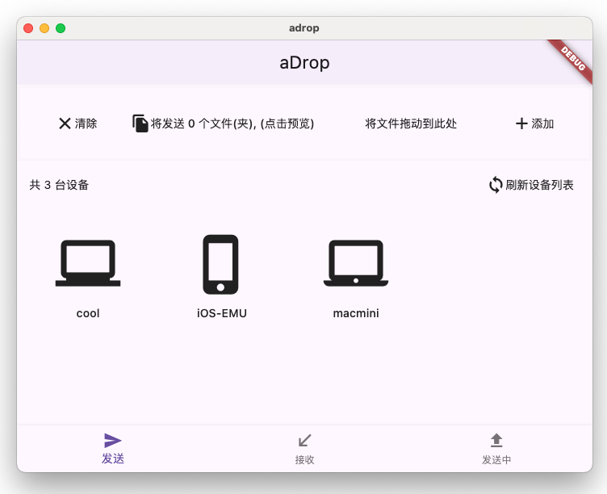
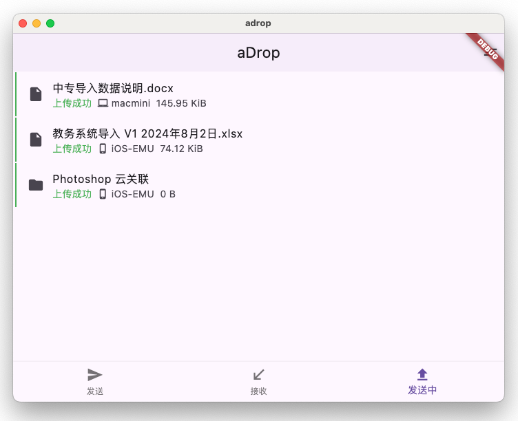
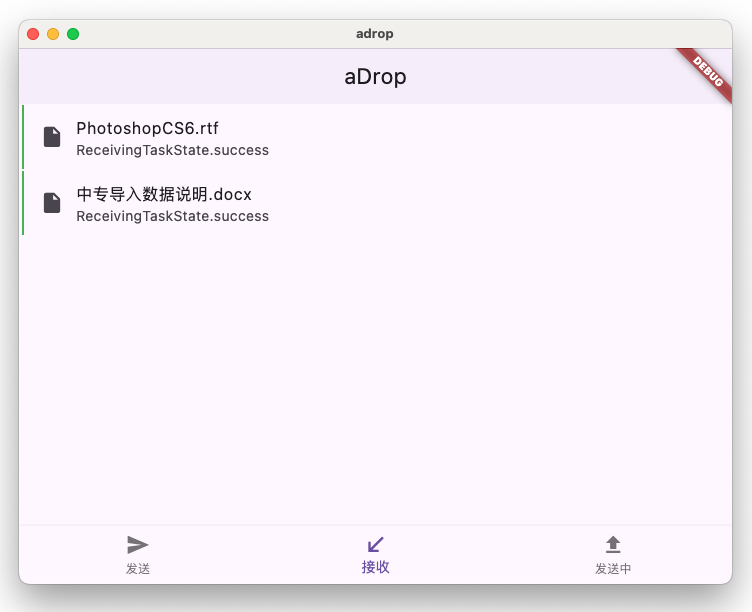
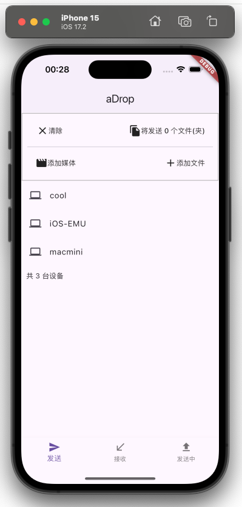

# ADrop

方便块跨局域网传输文件。无需自建服务器, 传输的过程中文件会进行加密，以保证数据的安全性。通过阿里云盘作为媒介。

基于阿里云盘 SDK for rust https://github.com/niuhuan/alipan-rs

## 截图

1. 发送文件: 将文件直接拖动到设备, 或添加文件到队列后点击设备

2. 发送任务队列

3. 接收任务队列

4. 移动端支持

## 开始使用

申请阿里云盘开发者账号

https://www.alipan.com/developer/f

## 技术架构

### 原理

- 文件传输：每一个设备拥有自己的文件夹，发送到其他设备时，将文件上传至目标设备的文件中。当文件接收设备发现有新文件时，会自动下载文件，下载完成后删除云盘中的文件。
- 文件加密：每1MB进行1次AES-GCM加密。

### 框架

客户端使用前后端分离架构, 界面使用flutter渲染引擎. rust提供高效io和加密计算. Dart与rust均为跨平台编程语言, 以此支持 android/iOS/windows/macOS 等不同操作系统.

